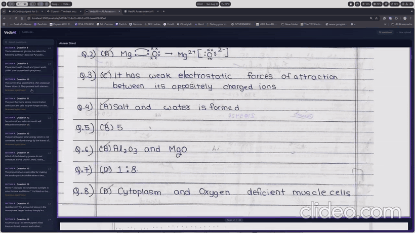

# VedaAI



▶ **[Watch the full demo with audio](https://github.com/SiddharthV147/VedaAI-Assignment/blob/main/video.mp4)**

Upload a question paper and a student answer sheet. The backend segments the
handwriting, reads it, maps each answer to its question, and the frontend
highlights the matching region on the PDF.

I tested with the 4 model answer papers from the CBSE website, which cover
clean, cursive, and messy handwriting.

## Pipeline

```
PDF to image conversion          (PyMuPDF, 300 dpi)
              |
Correcting the orientation       (4-way, ink profile)
              |
Binarisation of images           (adaptive + Otsu)
              |
Text detection using CRAFT       (CRAFT + refiner)
              |
Splitting into single lines      (blank-row cuts)
              |
Crop and reading order           (top-left order)
              |
Handwriting recognition          (TrOCR large)
              |
Question paper parsing           (regex sections)
              |
Answer marker detection          (Q-number heuristics)
              |
Mapping and coordinate restore   (original page space)
              |
Persistence and response         (JSON + crops)
```

Detection worked better on images than on PDFs, so every page is rasterised
first.

For cost efficiency, both text detection and text extraction run locally on
the machine rather than through a paid OCR API.

## Resources

Models

- [microsoft/trocr-large-handwritten](https://huggingface.co/microsoft/trocr-large-handwritten) — recognition model used locally
- [microsoft/trocr-base-handwritten](https://huggingface.co/microsoft/trocr-base-handwritten) — smaller variant used on Render

Reading

- [Best handwriting OCR tools for business](https://www.extend.ai/resources/best-handwriting-ocr-tools-business) — survey of the options before picking TrOCR
- [PaddleOCR text recognition module](https://www.paddleocr.ai/main/en/version3.x/module_usage/text_recognition.html#1-overview) — alternative recognition stack
- [Handwritten text recognition using OCR](https://learnopencv.com/handwritten-text-recognition-using-ocr/) — detection plus recognition walkthrough
